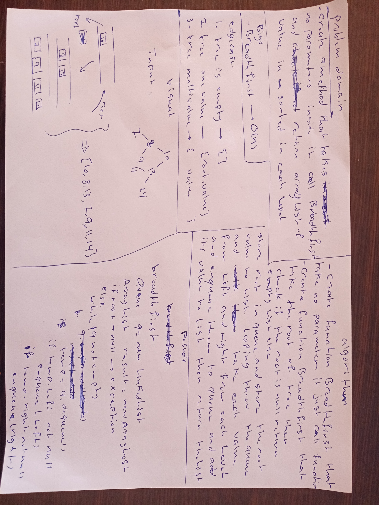
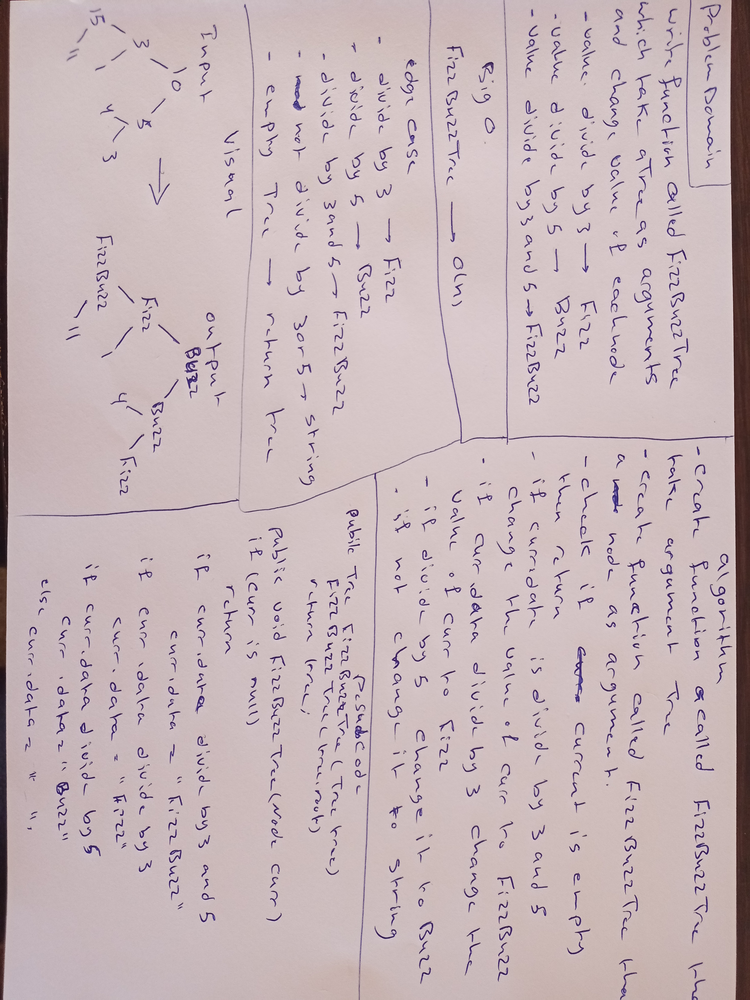

# Trees

## Challenge
- Create a Node class that has properties for the value stored in the node,the left child node, and the right child node.
- Create a BinaryTree class
- Define a method for each of the depth first traversals called preOrder, inOrder, and postOrder which returns an array of the values, ordered appropriately.
- Create a BinarySearchTree class
- Define a method named add that accepts a value, and adds a new node with that value in the correct location in the binary search tree.
- Define a method named contains that accepts a value, and returns a boolean indicating whether or not the value is in the tree at least once.
## Approach & Efficiency
- For depth first traversals, I use recursion to traverse and ArrayList to store my values in the specified order. 
- Preorder traversal requires me to add the current node value to the ArrayList first and recurse through the left node of the current node then recurse through the right. 
- Inorder would have me recurse through the left node first then add the value to the ArrayList then recurse through the right. 
- PostOrder is recursing through both the left and right first then add the value to the ArrayList. 
- All traversals would take O(n) time and space since every values in the binary tree would have to be visited and we are storing those values in an ArrayList.

- Adding node to Binary Search Tree is fairly straightforward. Starting at the root, check first the node is null. If it is, then the current node will be the new node that contains the input value. If not, then check if the value that you want to add is less than or greater than the current node's value. Go down tree either left or right depends on if the value is less than or greater than and recursively repeat the process.

- Searching is as straightforward since you are doing the same thing but at each node, you are checking if the node's value is equal to the input value. Otherwise just go left or right depending of if the value is less than or greater than. If you hit a node that is null, then that means the value is not in the tree so return false. Searching and adding would takes O(log(n)).
## API
### Binary Tree

- void add(int value) - takes in a value and randomly choose a spot on the tree to store the value.
- ArrayList<Integer> preOrder() - perform preOrder traversal and return an ArrayList of values in preOrder order.
- ArrayList<Integer> inOrder() - perform preOrder traversal and return an ArrayList of values in preOrder order.
- ArrayList<Integer> postOrder() - perform preOrder traversal and return an ArrayList of values in preOrder order.

### Binary Search Tree

- void add(int value) - takes in a value and add the value in the correct spot in BST.
- boolean contains(int value) - search the tree if the value is in the tree. Return true or false.

*******************************************************************************************

# Challenge Summary
<!-- Short summary or background information -->
Find the Maximum Value in a Binary Tree
## Challenge Description
<!-- Description of the challenge -->
Write an instance method called find-maximum-value. Without utilizing any of the built-in methods available to your language, return the maximum value stored in the tree. You can assume that the values stored in the Binary Tree will be numeric.

## Approach & Efficiency
<!-- What approach did you take? Why? What is the Big O space/time for this approach? -->
The solution will use a helper method that takes in a current node and also the maximum value found so far and return the max. Using recursion, first input the root of the tree and the value of the root into the helper method. The method will first check if the node is null or not. If it is, then return the max immediately. Otherwise, check if the current node value is greater than the max and change the max accordingly. Then recurse through the left and the right child nodes while passing in the current max. It is left to assume that the recursion will return the max of the left subtree and the right subtree and so at the end, just compare the two max and whichever is bigger we would return.

This implemenation would takes O(n) time since we have to traverse through every nodes and O(1) space since we only store the current max, left max and right max.

## Solution
<!-- Embedded whiteboard image -->
 

 ***************************************************************************************************
# Breadth-First Traversal
#  Challenge Summary
Breadth-first Traversal.
# Challenge Description
- Write a breadth first traversal method which takes a Binary Tree as its unique input. Without utilizing any of the built-in methods available to your language, traverse the input tree using a Breadth-first approach; print every visited node’s value.

# Approach & Efficiency
- In order to keep track of all the nodes from left to right at each level as we traverse down the tree, a queue was used to hold all the nodes at each level. To implement this, we would first enqueue the root of the tree into our queue. Then using a while loop, checks if the q is empty or not. If it is, exits the loop, if not, then continue the iteration. Basically we would dequeue the front of the queue and print the node's value. Then we would check if the left and/or right of the node is null or not. If it is, we do not do anything. If not, we would enqueue the left adn/or the right child node into the queue. We continue until the queue is empty which is when we went through every nodes.

Time complexity of this is O(n) since we have to go through every nodes. Space complexity of this is O(log(n)) because the queue need to hold at most the number of nodes at the lowest level of the tree.

# Solution
 

 ************************************************************************************
# Fizz Buzz Tree

#  Challenge Summary
Conduct “FizzBuzz” on a k-ary tree while traversing through it to create a new tree.
# Challenge Description

- Write a function called FizzBuzzTree which takes a tree as an argument. Without utilizing any of the built-in methods available to your language, determine weather or not the value of each node is divisible by 3, 5 or both, and change the value of each of the nodes:

- If the value is divisible by 3, replace the value with “Fizz”
- If the value is divisible by 5, replace the value with “Buzz”
- If the value is divisible by 3 and 5, replace the value with “FizzBuzz”
- Return the tree with its new values.

# Approach & Efficiency
The approach is fairly straightforward. Traverse the tree using any sort of traversal (I use preorder traversal in my code) and for each node, checks if its value is divisible by 3, 5, or both and change the values according to the problem domain. Then recurse through all other nodes until null node has been hit.

Time complexity of this would be O(n) since we have to visit every nodes to check for its value.

# Solution
 