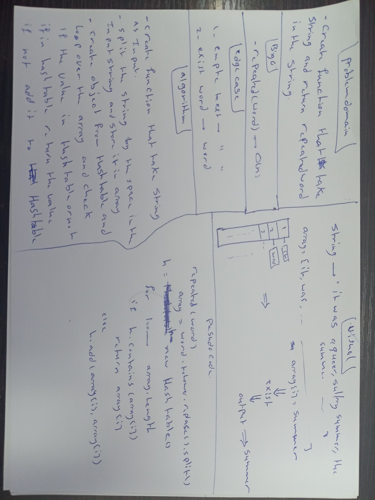

# Hashtables
<!-- Short summary or background information -->
A hash table is a data structure that allows key-value pairs to be stored within it. The advantage of a hash table over other data structures is that adding, removing, and lookup operations all take O(1) time to execute. This is achieved through utilizing a hash function that takes a key and convert that key into a integer index that determine where in the array that entry would be stored. The hash function is the heart of a hash table and the ability of the hash function to spread all entries somehwat evenly throughout all slots in the array determine how efficient the hash table is.

## Challenge
<!-- Description of the challenge -->
#### Implement a Hashtable with the following methods:

- add: takes in both the key and value. This method should hash the key, and add the key and value pair to the table, handling collisions as needed.
- get: takes in the key and returns the value from the table.
- contains: takes in the key and returns a boolean, indicating if the key exists in the table already.
- hash: takes in an arbitrary key and returns an index in the collection.

## Approach & Efficiency
<!-- What approach did you take? Why? What is the Big O space/time for this approach? -->
- all function take O(1) time.

- This hash table will implement separate chaining as the method to deal with collisions. Separate chaining involves storing entries in the hashtable in an array of linked lists so that even if a collision was to happen, the entry would just be added on to the linked list at that index of the array.

## API
<!-- Description of each method publicly available in each of your hashtable -->
- Implement a hash table that has the following methods:

- add: takes in both the key and value. This method should hash the key, and add the key and value pair to the table, handling collisions as needed.
- get: takes in a key and returns the value from the hashTable.
- getNode: takes in a key and returns the Node from the LinkedList.

- contains: takes in the key and returns a boolean, indicating if the key exists in the table already.
- hash: takes in an arbitrary key and returns an index in the collection.

##### code 31 
# Challenge Summary
<!-- Description of the challenge -->
- Write a function that accepts a lengthy string parameter and  return the first word to occur more than once in that provided string.

## Whiteboard Process
<!-- Embedded whiteboard image -->

## Approach & Efficiency
<!-- What approach did you take? Why? What is the Big O space/time for this approach? -->
- The algorithm will utilize a hash table to keep track of all the words that are seen so far. The current word that is being examined will be checked against the hash table to see if the word exist in the table as a key. If it exists, then that means the word has been repeated so we return it. Otherwise move on the next word. If we have not encountered any repeated word at the end when we look at every words, then return null.
repeated()--> O(n)

## Solution
<!-- Show how to run your code, and examples of it in action -->
- first defined text and store the whole string you need to check.
- then call the function and pass the text to it
- the function will return the repeated word.
