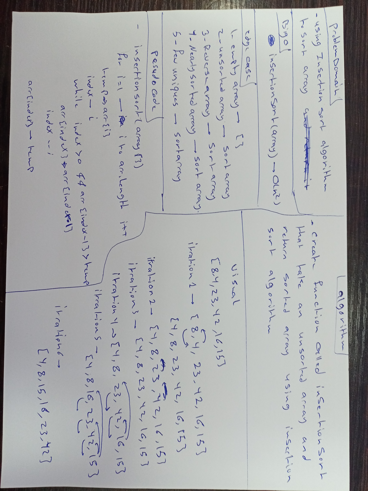

# Challenge Summary
<!-- Description of the challenge -->
create function that take unsorted array and return sorted array using Insertionsort algorithm

## Whiteboard Process
<!-- Embedded whiteboard image -->
 

## Approach & Efficiency
<!-- What approach did you take? Why? What is the Big O space/time for this approach? -->
insertionsort(arr[]) O(n2)

## Solution
<!-- Show how to run your code, and examples of it in action -->

create object from insertionSort class and call the insertionSort function then pass array to it 

