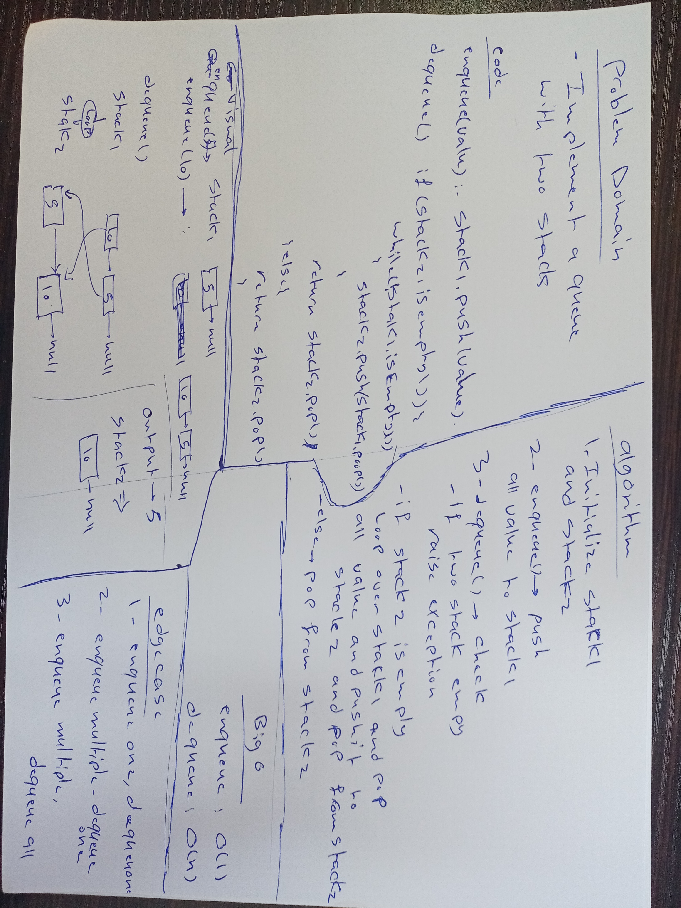

# Stacks 
<!-- Short summary or background information -->
A stack is a data structure that consists of Nodes. Each Node references the next Node in the stack, but does not reference its previous.

## Challenge
<!-- Description of the challenge -->
create class called Stack with basic method to be implement the first method isEmpty method to check if stack empty 
the second method push to add new value to the stack the third method is pop to delete the first value on the stack
the last one is peek to print the value on top of the stack

## Approach & Efficiency
<!-- What approach did you take? Why? What is the Big O space/time for this approach? -->
- isEmpty() O(1)
- push() O(1)
- pop() O(1)
- peek() O(1)

## API
<!-- Description of each method publicly available to your Stack and Queue-->
- create constructor the initial the stack to null when we create an instance
- create isEmpty() function to check if stack is empty or not
- create push() function that take an value as input then insert it on top of stack
- create pop() function that delete the node on the top and return the value that was in the top 
- create peek() function that print the value in the top of stack
 

# Queues
<!-- Short summary or background information -->
 A Queue is a linear structure which follows a particular order in which the operations are performed. The order is First In First Out (FIFO)
## Challenge
<!-- Description of the challenge -->
create class called Queue with basic method to be implement the first method isEmpty method to check if Queue empty 
the second method enqueue to add new value to the rear of Queue the third method is dequeue to delete from the first Queue value on the Queue
the last one is peek to print the value that on the first node on Queue

## Approach & Efficiency
<!-- What approach did you take? Why? What is the Big O space/time for this approach? -->
- isEmpty() O(1)
- enqueue() O(1)
- dequeue() O(1)
- peek() O(1)
## API
<!-- Description of each method publicly available to your Stack and Queue-->
- create constructor the initial the Queue with to node front and tail to null when we create an instance
- create isEmpty() function to check if Queue is empty or not
- create enqueue() function that take an value as input then insert it on tail if not empty it empty will add to the front of Queue
- create dequeue() function that delete the node on the front of the queue and return the value that was in the front 
- create peek() function that print the value in the front of Queue

# code challenge 11

# Challenge Summary
<!-- Short summary or background information -->

## Challenge Description
<!-- Description of the challenge -->
- Implement a Queue using two Stacks. This PseudoQueue class should internally utilize two stack objects implemented in previous lab. The PseudoClass should have the following methods:

- enqueue(value) which inserts value into the PseudoQueue, using a first-in, first-out approach.
- dequeue() which extracts a value from the PseudoQueue, using a first-in, first-out approach.

## Approach & Efficiency
<!-- What approach did you take? Why? What is the Big O space/time for this approach? -->
- enqueue(value) O(1)
- dequeue() O(n)

## Solution
<!-- Embedded whiteboard image -->

