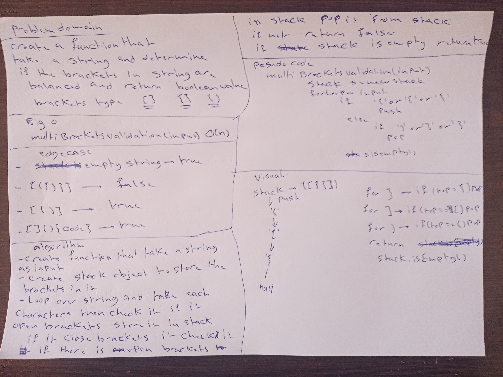

# Challenge Summary
<!-- Short summary or background information -->
First-in, First out Animal Shelter.
## Challenge Description
<!-- Description of the challenge -->
Create a class called AnimalShelter which holds only cat and dog. The shelter operates using a first-in, first-out approach like a queue. Implement the following methods:

enqueue(animal): adds animal to the shelter. animal can be either a dog or a cat object.
dequeue(pref): returns either a dog or a cat. If a cat or dog isn’t preferred, return whichever animal has been waiting in the shelter the longest.
## Approach & Efficiency
<!-- What approach did you take? Why? What is the Big O space/time for this approach? -->
For enqueue O(1) 
For dequeue O(1)
## Solution
<!-- Embedded whiteboard image -->

# MultiBracketValidation

# Challenge Summary
<!-- Short summary or background information -->
Multi-bracket Validation.
## Challenge Description
<!-- Description of the challenge -->
Write a function that takes a string as its only argument and should return a boolean representing whether or not the brackets in the string are balanced. There are 3 types of brackets: [], (), {}.

Sample Input: ()[[Extra Characters]]

Sample Output: TRUE

## Approach & Efficiency
<!-- What approach did you take? Why? What is the Big O space/time for this approach? -->
A validated string of brackets should have all left brackets matching its counterpart right brackets and in the correct order as well. [{]} have matching brackets but they are not in the correct order. The most recently seen left brackets if reading from left to right should have the next right brackets match it. Therefore, implementing a stack would make the most sense here to keep track of the most recently seen left brackets. The algorithm is pretty simple. Start by first initialize a Stack and going through each character in the string using a loop. Then check if the character is any of the left brackets. If it is, then add it to the stack. Otherwise, if it is any of the right brackets, check the top of the stack for which left bracket it needs to match. If the right bracket does not match the left bracket, then return false immediately. On the other hand, if they match, then pop off the matched left bracket from the stack and continue to the next character. Check for all characters and see at the end if the stack is empty or not. If it is not empty, then that means there were left brackets that were not matched and function should return false. If it is empty, then that means we matched every bracket with its counterpart and so it should return true.

multiBracketValidation(input) O(n)

## Solution
<!-- Embedded whiteboard image -->

