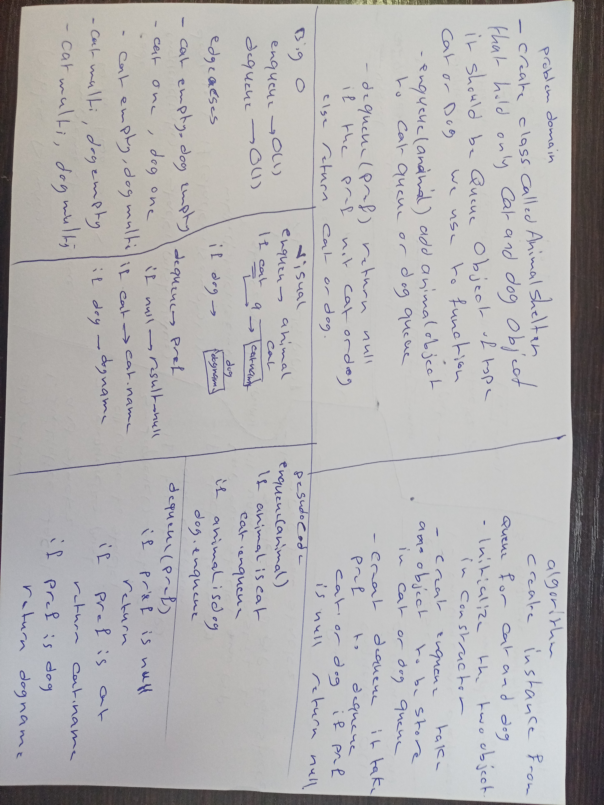

# Challenge Summary
<!-- Short summary or background information -->
First-in, First out Animal Shelter.
## Challenge Description
<!-- Description of the challenge -->
Create a class called AnimalShelter which holds only cat and dog. The shelter operates using a first-in, first-out approach like a queue. Implement the following methods:

enqueue(animal): adds animal to the shelter. animal can be either a dog or a cat object.
dequeue(pref): returns either a dog or a cat. If a cat or dog isn’t preferred, return whichever animal has been waiting in the shelter the longest.
## Approach & Efficiency
<!-- What approach did you take? Why? What is the Big O space/time for this approach? -->
For enqueue O(1) 
For dequeue O(1)
## Solution
<!-- Embedded whiteboard image -->

