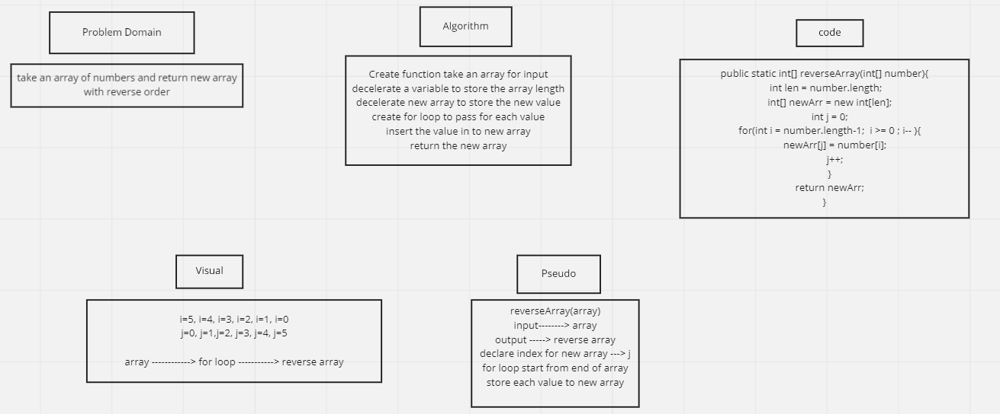

# Data Structures and Algorithms

## Language: `Java`

# Reverse an Array
<!-- Short summary or background information -->

## Challenge
<!-- Description of the challenge -->
take an array of number and return new array with same number but deferent order 

## Approach & Efficiency
<!-- What approach did you take? Why? What is the Big O space/time for this approach? -->
i use for loop and Arrays class to print it 

## Solution
<!-- Embedded whiteboard image -->

 

