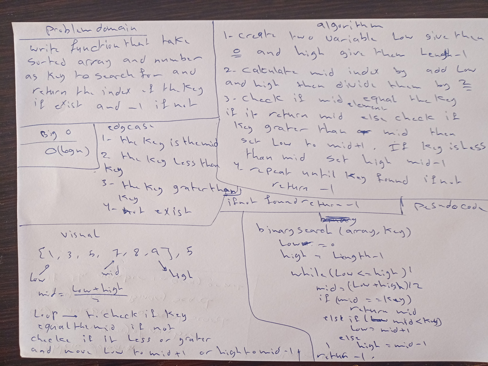

# Data Structures and Algorithms

## Language: `Java`

# Reverse an Array
<!-- Short summary or background information -->

## Challenge
<!-- Description of the challenge -->
- take an array of number and return new array with same number but deferent order 

## Approach & Efficiency
<!-- What approach did you take? Why? What is the Big O space/time for this approach? -->
- i use for loop and Arrays class to print it 

## Solution
<!-- Embedded whiteboard image -->

 

 # Challenge Summary
<!-- Short summary or background information -->
- take an array of number and new number return new array with same number and the new number in the middle

## Challenge Description
<!-- Description of the challenge -->
it take an array and number then do some operation and return new array with number add in the middle.

## Approach & Efficiency
<!-- What approach did you take? Why? What is the Big O space/time for this approach? -->
i use for loop to store item to new array then use for loop to shift item to right and store the new value in empty position.

## Solution
<!-- Embedded whiteboard image -->
 

 # Challenge Summary
<!-- Short summary or background information -->
- take an array of number and  number return the index of number if it exist and -1 if it is not exist
## Challenge Description
<!-- Description of the challenge -->
Write a function called BinarySearch which takes in 2 parameters: a sorted array and the search key. Without utilizing any of the built-in methods available to your language, return the index of the array’s element that is equal to the search key, or -1 if the element does not exist.

## Approach & Efficiency
<!-- What approach did you take? Why? What is the Big O space/time for this approach? -->
Binary Search is an algorithm that used to search for a certain element within a sorted array. The main aspect of binary search is that we cut in half the section of the array that we are conducting the search to help significantly sorten the amount of compares that we have to do as opposed to a linear search. To do a binary search, we needs to define our lower and upper bounds which represent where we going to do our search within. In the very beginning, our lower bound would be the zeroth index and upper bound would be the array length minus one. Then we would calculate our mid index between the two bounds by taking the average between them. Using this mid index, we would then check if the element at the mid index is equal to the key that we are trying to search. If it is great we would just return the mid index. If not, then we would check if the key is either greater than or less than the element at the mid index. If greater than, move the lower bound to be mid + 1 and if less than, move the upper bound to be mid - 1. We do this because since we know that this array is sorted, if the key is greater than the mid element, we know that it cannot possibly be to the left of the mid so we effectively get rids of the left half and move our bounds so that we are now only searching at the right half and vice versa. We keep doing this until we either find the key in which we would return the mid index at that point, or if we exhausted our search in which we return -1.

## Solution
<!-- Embedded whiteboard image -->
 

# Singly Linked List
<!-- Short summary or background information -->
- it is node connected with pointer 

## Challenge
<!-- Description of the challenge -->
- create linkedList class with three function insert includes and toString.

## Approach & Efficiency
<!-- What approach did you take? Why? What is the Big O space/time for this approach? -->
-i create class node to initial the node value and pointer 
- i create class linkedList to create list of node 
- I create class main to run the code
- insert O(1)
- includes O(n)
- toString O(n)

## API
<!-- Description of each method publicly available to your Linked List -->
1. insert take an integer to inserted it to the LinkedList
2. include take an integer  to check if it exist in the list or not if exist return true if not false
3. toString print the component of the linkedList

# Code Challenge  lab 06
# Challenge Summary
<!-- Short summary or background information -->
it is node connected with pointer and store value in it 

## Challenge Description
<!-- Description of the challenge -->
- create new three function to add bode in different position
- append(value) add the new node to the last of linkedList
- Add Before(value , new value) add new node in specific position before the given value
- Add After (value, new value) add new node in the specific position after given value

## Approach & Efficiency
<!-- What approach did you take? Why? What is the Big O space/time for this approach? -->
- append O(n)
- addBefore O(n)
- addAfter O(n)
## Solution
<!-- Embedded whiteboard image --> 
 
 

# Code Challenge  lab 07
 # Challenge Summary
<!-- Short summary or background information -->
- create function that take an index of node and retrun the value in that index 

## Challenge Description
<!-- Description of the challenge -->
create function that take int value as input and return the value in that index if it exist if not return Exception

## Approach & Efficiency
<!-- What approach did you take? Why? What is the Big O space/time for this approach? -->
- indexNode O(n)

## Solution
<!-- Embedded whiteboard image -->
 

 # Code Challenge  lab 08
 # Challenge Summary
<!-- Short summary or background information -->
- create function that take to linked list and zip them to gather and return new linked list with all node from two list 

## Challenge Description
<!-- Description of the challenge -->
- create function that take two linked list and check first if they empty or not if empty it will return the other list if not it will combine the two list to gather and return the new list with all value from the two list

## Approach & Efficiency
<!-- What approach did you take? Why? What is the Big O space/time for this approach? -->
- zipLinkedList O(n)

## Solution
<!-- Embedded whiteboard image -->
 

 